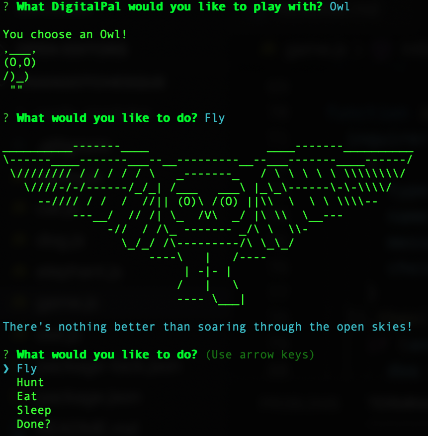

  

*Bored?... Need to waste 20-30+ minutes?... Well then Tamagotchesque is perfect for you!*  
*Not bored?... Well give it a try anyways!*  

**What is Tamagothcesque - Your DigitalPal?** It is a Tamagotchi type game.  
**Where do I play with this "so called" DigitalPal?** Directly in your command line.  
**When should I do this?** There's no time like the present. Do it now!!  
**How does it work?** Using Node of course.  
**Why should I?** Why not?  
**A little more information please?** Ok... fine:  
- Choose a DigitalPal to play with.  
- Each time that you play with your pal you have a posibility of experiencing different play outcomes.  
- After you've finished playing don't forget to eat something.  
- Once you've had a full "day" it's time to go to sleep.  
- Wake up and have another full "day" with your DigitalPal and/or choose a different DigitalPal to play with.  

It's as simple as that!

# Install  
Create a folder where you would like to access this game and run the following commands in this directory from your command line.  
`$ npm init -y` to create a package.json file  
`$ npm install tamagotchesque` to install the game  
`$ npm install` in order to make sure that all of the dependencies have been installed correctly on your local machine  

# Usage  
In the root directory of your project create a new file - for example `app.js` - and within that file require the package and call it:  
````javascript
const tama = require("tamagotchesque")  
tama.game  
````  
Then in your command line (making sure you are in the correct directory) run `node app.js` and have fun!  
*Or if you named your file something else, replace 'app.js' with the name of your file.*   
  
You will have the best user experience if you size your command line window to be at least 115 wide x 30 long.  

Also, with the coloring it appears to look best against a black background.  

Most importantly... HAVE FUN!!!  

# Tech Used  
Javascript  
Node  
- Inquirer  
- Colors  

# Preview   
  

# Credits  
For putting together an awesome library of ASCII Art images from whence I obtained most of the artwork: [ascii-art.de](http://www.ascii-art.de/ascii/)  
For creating ASCII Art words in multiple different fonts: [patorjk.com](http://patorjk.com/software/taag/#p=display&f=Graffiti&t=Type%20Something%20)  