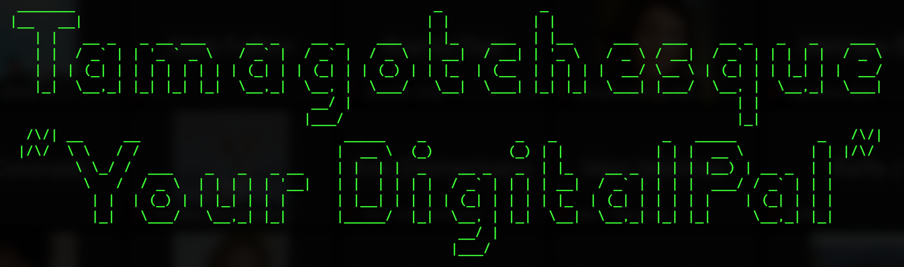

  

*Bored?... Need to waste 20-30+ minutes?... Well then Tamagotchesque is perfect for you!*  
*Not bored?... Well give it a try anyways!*  

**What is Tamagothcesque - Your DigitalPal?** It is a Tamagotchi type game.  
**Where do I play with this "so called" DigitalPal?** Directly in your terminal.  
**When should I do this?** There's no time like the present. Do it now!!  
**How does it work?** Using Node of course.  
**Why should I?** Why not? 

# Install  
`$ npm install tamagotchesque`  
After you do so make sure that you are in the root directory of the project, then run `$ npm install` in order to make sure that all of the dependencies have been installed correctly on your local machine.  

# Usage  
Make sure that you are in the root directory of the project and then in your terminal run `node game.js` then have fun!  
  
You will have the best user experience if you size your terminal window to be at least 115 wide x 30 long.  

# Tech Used  
Javascript  
Node  
- Inquirer  
- Colors  

# Preview   
  

# Credits  
For putting together an awesome library of ASCII Art images from whence I obtained most of the artwork: [ascii-art.de](http://www.ascii-art.de/ascii/)  
For creating ASCII Art words in multiple different fonts: [patorjk.com](http://patorjk.com/software/taag/#p=display&f=Graffiti&t=Type%20Something%20)  